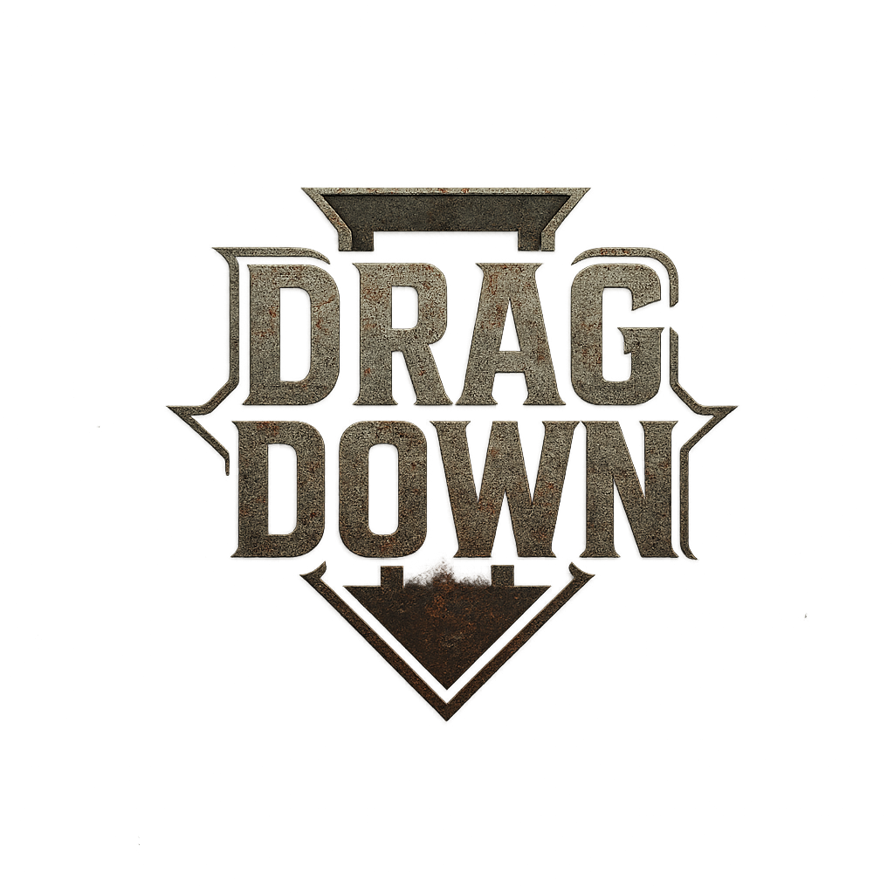
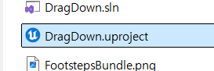
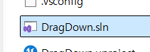
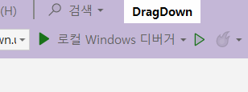

2025-1학기 단국대학교 캡스톤 디자인

# 1. Project Overview
- Project Name: Drag Down
- Game Genre: Multiplayer competitive platform game

## 프로젝트 참여자
| 정현우 | 변성준 | 박지원 |
|:------:|:------:|:------:|
| Game Client | Backend | PM & DevOps |
| [GitHub](https://github.com/Lagooneng) | [GitHub](https://github.com/Coffeecaat) |  |

## 진행 기간
2025.03.12 ~ 2025.06.11

# 2. 주요 기능 및 구현 (게임 클라이언트)
- **Local Prediction이 적용된 액션**
  - 예측을 통한 공격, 회피 인풋 레이턴시 최소화
    
- **RPC를 통한 타 클라이언트 애니메이션 동기화 최적화**
  - 자신이 아닌 다른 클라이언트의 애니메이션 동기화가 느린 문제를 RPC로 해결

- **Network Object Pooling**
  - World Subsystem 기반 네트워크 상에서 동기화되는 Object Pooling 구현

- **Chatting**
  - Player Controller와 GameState 기반으로 채팅 기능 구현 

- **Stemina UI Prediction & Interpolation**
  - 실제 스테미나 값이 아닌, UI에 보이는 값만 예측해서 부드럽게 처리
  - 보간을 통해 스테미나 회복에 의한 UI 변경 자연스럽게 처리

- **AI 몬스터**
  - Behavior Tree 기반으로 주어진 위치를 순회하고, 캐릭터 감지 시 캐릭터를 쫓아가며 충돌 시 캐릭터를 밀쳐내는 AI Monter 제작
    
- **Gimmik Actor**
  - 정해진 Position, Rotation을 정해준 순서에 따라 반복하는 기믹 용도의 액터

- **액터 스포너**
  - 주기적으로 정해준 액터를 스폰해주는 액터

- **Surface Detection System**
  - 플레이어의 발 밑을 트래이스하여 Physical Material 및 Surface type 감지

- **Option Menu**
  - 유저가 그래픽, 디스플레이, 오디오, 외형 관련 설정을 할 수 있도록 함

- **DLSS 적용**
  - DLSS 업스케일링 유저가 원하고 사용 가능한 그래픽 카드인 경우 적용 가능
 
- **로그인, 회원가입, 매치메이킹 연동 및 UI**
  - 자체 백엔드 서버에 FHttpModule을 이용하여 리퀘스트하고, 리스폰스를 받음

- **Skeletal Mesh Merging In Runtime**
  - SkeletalMergingLibrary를 사용하여 런타임에 스켈레탈 메시를 병합

- **캐릭터 외형 미리보기**
  - USceneCaptureComponent2D를 이용하여 옵션에서 캐릭터 외형을 변경하는 동시에 확인 가능한 UI 제공

- **대기방 및 Ready 상태 관리**
  - 대기방을 만들고 GameState와 PlayerState를 통해 각 플레이어의 Ready 상태를 관리

- **3가지 맵 테마**
  - 서부 마을, 해상 암초, 눈덮인 지역 컨셉으로 세 가지 테마로 레벨을 디자인

- **승리 여부에 따라 게임 엔딩 분기 처리**
  - 승리, 패배에 따라 다른 레벨로 이동시키고, 서버가 항상 마지막에 맵 이동을 하도록 하여 안전하게 설계

# 3. Teck Stack
## Game Client
- Unreal Engine 5.5.4
- Gameplay Ability System
  - Local Prediction
- Listen Server

## Backend
- Spring Boot
- PostgrSQL
- Redis

# 4. 프로젝트 구조
```plaintext
DragDown/
├── Config/                         # 게임 설정 파일들
├── Content/                        # 사용할 컨텐츠
│   ├── 01_Blueprint/               # 블루프린트
│   │   ├── AI/                     # AIController, AI Character
│   │   ├── Actor/                  # 액터 혹은 액터의 서브클래스 기반 블루프린트
│   │   ├── DataAsset/              # 데이터 애셋 블루프린트
│   │   ├── GA/                     # Gameplay Ability, Gameplay Effect
│   │   ├── Game/                   # 게임 모드
│   │   ├── Player/                 # Player Controller, Character 기반 플레이어 클래스의 블루프린트
│   │   ├── UI/                     # 채팅, 게임 엔딩, HUD, 메인 메뉴, 옵션 메뉴, 설명창, 대기방, 방 등 UI
│   ├── 02_Level/                   # 게임에서 사용하는 Level
│   ├── 03_Animation/               # Blend Space, Montage, Notify, Sequence
│   ├── 04_Mesh/                    # 게임에서 사용되는 스태틱 메시, 스켈레탈 메시
│   ├── 05_Image/                   # 게임에서 사용되는 이미지
│   ├── 06_Input/                   # 인풋 매핑 컨텍스트, 인풋 액션
│   ├── 07_Render/                  # 렌더 타겟 및 렌더 타겟 용 머티리얼
│   ├── 08_Material/                # 일반 머티리얼
│   ├── 09_PhysicalMaterial/        # 피지컬 머티리얼
│   ├── 10_BehaviorTree/            # 블랙 보드, BehaviorTree
│   ├── 11_Sound/                   # 사운드, 사운드 믹서, 사운드 클래스
│   ├── 99_Materials_Vol2/          #  기타 애셋 폴더..
│   ├── ....                        #  기타 애셋 폴더들
├── Source/                         #  소스 코드
│   ├── DragDown/                  
│   │   ├── AI/                     #  AI 관련 클래스
│   │   ├── Actor/                  #  Actor 기반 클래스
│   │   ├── Animation/              #  Animation 관련 클래스
│   │   ├── Attribute/              #  GAS Attribute
│   │   ├── Character/              #  Character 기반 클래스
│   │   ├── DataAsset/              #  DataAsset 클래스
│   │   ├── GA/                     #  Gameplay Ability, Ability Task, Target Actor
│   │   ├── Game/                   #  GameState, GameMode
│   │   ├── Interface/              #  Interface
│   │   ├── Physics/                #  물리 설정 파일
│   │   ├── Player/                 #  PlayerController, PlayerState
│   │   ├── Setting/                #  커스텀 GameUserSetting 클래스
│   │   ├── Subsystem/              #  World Subsystem, GameInstanceSubsystem
│   │   ├── Tag/                    #  Gameplay Tag
│   │   ├── UI/                     #  User Widget & WidgetComponent for GAS
│   │   ├── DragDown.Build.cs       #  종속성
│   │   ├── DragDown.cpp            #  프로젝트 세팅
│   │   ├── DragDown.h              #  프로젝트 세팅 (로그)
│   ├── DragDown.Target.cs          #  프로젝트 세팅
│   ├── DragDownEditor.Target.cs    #  프로젝트 세팅
├── .gitignore                      #  Git 무시 파일 목록
├── .vsconfig                       #  Visual Studio 구성 파일
├── DragDown.uproject               #  프로젝트 메타데이터, 설정
├── FootstepsBundle.png             # 애셋 관련 이미지
└── README.md                       # 프로젝트 개요 및 사용법
```

# 5. 실행 방법
## 5.1. 패키징된 파일이 있는 경우
- exe 파일 실행

## 5.2. Github에서 Clone하기
### 5.2.1. Unreal Engine 5.5 설치
- [설치](https://www.unrealengine.com/ko/download)

### 5.2.2. Clone 후 uproject 나 Visual Studio에서 실행

- .uproject 더블클릭

혹은

- Visual Studio를 켜고


- 실행하기

# 6. 관련 링크
## 시연 영상
[Youtube](https://www.youtube.com/watch?v=jUFSaVU_6lU)

## 블로그
[DragDown Blog](https://lagooneng.tistory.com/category/%EC%96%B8%EB%A6%AC%EC%96%BC%20%EC%97%94%EC%A7%84/Drag%20Down)

## 백엔드 리포지토리
[DragDown Spring boot Server GitHub Repository](https://github.com/Coffeecaat/DragDown)
- Spring Boot
- PostgreSQL
- Redis
- => Matchmaking Server!
